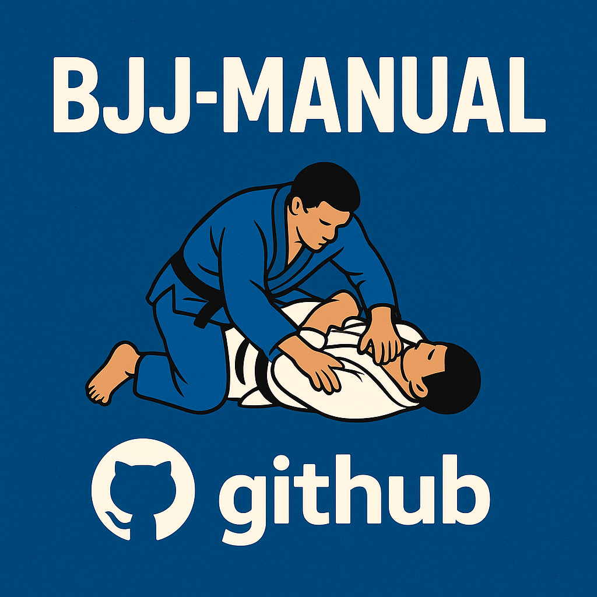

<div align="center">

# 🥋 BJJ Manual



> A comprehensive digital manual for Brazilian Jiu-Jitsu techniques, featuring interactive 3D models, video tutorials, and bilingual support.

</div>


## 📖 Overview

**BJJ Manual** is a modern web application designed to help practitioners of all levels learn and master Brazilian Jiu-Jitsu techniques. The platform provides an organized, searchable library of techniques with video demonstrations, detailed descriptions, and interactive 3D visualizations.

### ✨ Key Features

- 🎯 **Comprehensive Technique Library** - Organized by position (Closed Guard, Side Control, Mount, Back, Crucifix, and more)
- 🎥 **Video Tutorials** - Embedded YouTube videos for each technique
- 🌍 **Bilingual Support** - Full English and Spanish translations
- 🎨 **Modern UI/UX** - Beautiful, responsive design with dark mode support
- 🎭 **3D Visualizations** - Interactive 3D models powered by Three.js
- ⚔️ **Attack & Defense** - Techniques categorized by offensive and defensive moves
- 🔍 **Easy Navigation** - Intuitive interface to browse and discover techniques
- 📱 **Mobile Friendly** - Fully responsive design for all devices

## 🚀 Getting Started

### Prerequisites

- Node.js 18+ 
- npm, yarn, pnpm, or bun

### Installation

1. **Clone the repository**
   ```bash
   git clone https://github.com/yourusername/bjj-manual.git
   cd bjj-manual
   ```

2. **Install dependencies**
   ```bash
   npm install
   # or
   yarn install
   # or
   pnpm install
   ```

3. **Run the development server**
   ```bash
   npm run dev
   # or
   yarn dev
   # or
   pnpm dev
   ```

4. **Open your browser**
   Navigate to [http://localhost:3000](http://localhost:3000)

## 📁 Project Structure

```
bjj-manual/
├── app/
│   ├── components/          # React components
│   │   ├── bjj-model.tsx    # 3D BJJ model component
│   │   ├── mode-toggle.tsx  # Dark mode toggle
│   │   └── navbar.tsx       # Navigation bar
│   ├── contexts/            # React contexts
│   │   └── language-context.tsx
│   ├── data/
│   │   └── techniques.ts    # Technique database
│   ├── techniques/          # Techniques pages
│   ├── translations/        # UI translations
│   └── page.tsx             # Home page
├── components/
│   └── ui/                  # Reusable UI components
└── lib/
    └── utils.ts             # Utility functions
```

## 🎓 Technique Categories

The manual is organized into the following position categories:

- **Closed Guard** - Techniques from closed guard position
- **Side Control** - Side control attacks and transitions
- **Mount** - Mount position techniques and escapes
- **Back** - Back control and back takes
- **Crucifix** - Crucifix position techniques
- **Double Sleeve** - Double sleeve guard techniques

Each technique includes:
- Detailed descriptions in English and Spanish
- Video demonstrations
- Attack or defense classification
- Unique identifier for easy reference

## 🛠️ Tech Stack

- **Framework**: [Next.js 14](https://nextjs.org/) - React framework with App Router
- **Language**: [TypeScript](https://www.typescriptlang.org/) - Type-safe JavaScript
- **Styling**: [Tailwind CSS](https://tailwindcss.com/) - Utility-first CSS framework
- **3D Graphics**: [Three.js](https://threejs.org/) & [React Three Fiber](https://docs.pmnd.rs/react-three-fiber) - 3D visualizations
- **UI Components**: [Radix UI](https://www.radix-ui.com/) - Accessible component primitives
- **Animations**: [Framer Motion](https://www.framer.com/motion/) - Motion library
- **Theming**: [next-themes](https://github.com/pacocoursey/next-themes) - Dark mode support
- **Icons**: [Lucide React](https://lucide.dev/) - Beautiful icon library

## 📝 Adding Techniques

Techniques are stored in `app/data/techniques.ts`. To add a new technique:

```typescript
{
  id: 'technique-id',
  subcategory: 'attack', // or 'defense'
  title: {
    en: 'English Title',
    es: 'Título en Español'
  },
  description: {
    en: 'English description...',
    es: 'Descripción en español...'
  },
  videoUrl: 'https://www.youtube.com/embed/VIDEO_ID'
}
```

## 🎨 Customization

### Theme

The app supports light and dark themes. Users can toggle between themes using the mode toggle in the navigation bar.

### Language

The application supports English and Spanish. Language switching is handled through the language context.

## 📦 Build for Production

```bash
npm run build
npm start
```

## 🤝 Contributing

Contributions are welcome! Please feel free to submit a Pull Request. When adding new techniques:

1. Follow the existing data structure
2. Include both English and Spanish translations
3. Ensure video URLs are in embed format
4. Test the application locally

## 📄 License

This project is open source and available under the [MIT License](LICENSE).

## 🙏 Acknowledgments

- All BJJ practitioners and instructors who inspire this project
- The open-source community for the amazing tools and libraries

---

**Built with ❤️ for the BJJ community**
